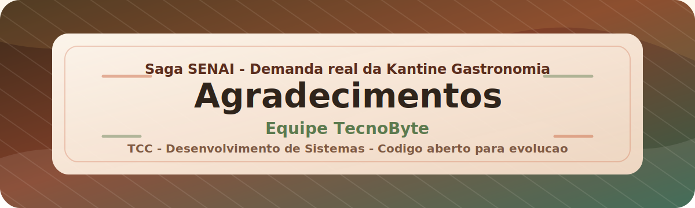

# Agradecimentos

  

  <strong>Saga SENAI - Kantine Gastronomia - Equipe TecnoByte</strong> 
  Projeto de TCC do curso técnico em Desenvolvimento de Sistemas.

---

Este projeto faz parte do **Saga SENAI** e nasceu de uma demanda real da **Kantine Gastronomia**. A equipe **TecnoByte** recebeu esse desafio com o objetivo de entender uma necessidade concreta, organizar ideias e desenvolver uma solução capaz de apoiar a rotina da cozinha, do cardápio, do estoque e dos indicadores do negócio.

Ao longo de meses de planejamento, desenvolvimento, testes, ajustes e apresentações, este sistema foi ganhando forma. Mais do que uma entrega técnica, ele representa aprendizado aplicado, trabalho em equipe, responsabilidade e o encerramento de uma etapa importante: o último projeto apresentado para a formação no curso técnico em **Desenvolvimento de Sistemas**.

## Nosso obrigado

Agradecemos ao **SENAI** pela formação, pela orientação e pela oportunidade de transformar conhecimento em prática. Agradecemos a **Kantine Gastronomia** pela confiança, pelo contexto real e pela possibilidade de construir uma solução pensada para uma necessidade de verdade.

Também agradecemos, com muito carinho, aos professores que acompanharam nossa caminhada e ajudaram este projeto a evoluir com orientações, correções, incentivo e conhecimento.

Em muitos momentos, quando o cansaço bateu e a vontade de desistir dos projetos, ou até mesmo do curso, parecia maior que a nossa força, vocês nos motivaram a continuar. Cada conselho, cobrança, conversa e palavra de apoio fez diferença para que a equipe TecnoByte não parasse no meio do caminho.

- **Karina**
- **Mateus Moreira**
- **Lorrany Marim**
- **Cássio Nascimento**
- **Juliano Silva**

Mais do que conteúdos técnicos, vocês nos ensinaram sobre responsabilidade, paciência, colaboração e compromisso. Essa trajetória nos fez crescer como pessoas, como futuros profissionais e como amigos. A relação construída foi além de aluno e professor, além de colegas em um ambiente de trabalho: tornou-se uma troca entre seres humanos que aprenderam, erraram, evoluíram e chegaram até aqui juntos.

## Código aberto

Este código é aberto. Caso alguém queira estudar, adaptar, melhorar, sugerir mudanças ou continuar evoluindo a ideia, pode fazer isso sem problema algum.

**Toda contribuição que ajude o projeto a crescer é bem-vinda.**

---

 
 

<strong>Com carinho, dedicação e orgulho, Equipe TecnoByte.</strong> <em>Obrigado por fazer parte dessa história.</em>

